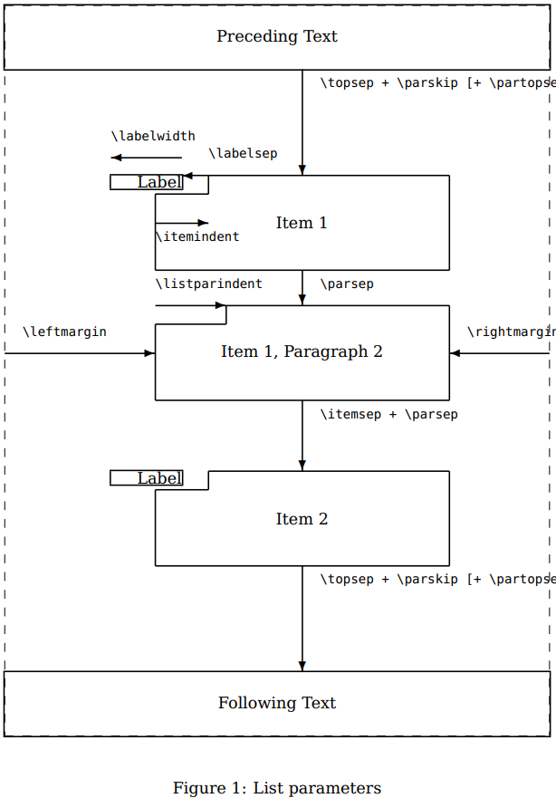

!> 点击 [overleaf project](https://www.overleaf.com/read/mjzpcxztzqzv)   可 clone 最新完整可使用版本!


## 文档类选项

```latex
\documentclass[<options>]{.def/must}
```
有多个选项时,用英文逗号分隔
```latex
\documentclass[
    writingLanguage=chinese,
    addPageTitle=on,
    addDeclaration=on,
    addMUSTlog=off,
    printing=off,
    refIndent=on,
    addFigTOC=on,
    addTabTOC=on,
]{.def/must}
```

**option:** 

- ` writingLanguage=english`英文版的模板
- `writingLanguage=chinese` 中文模板
- `addPageTitle=on` 添加扉页
- `addPageTitle=off` 不添加扉页
- `addDeclaration=on`添加原创声明页
- `addDeclaration=off`不添加原创声明页
- `addMUSTlog=on` 添加学校校徽水印
- `addMUSTlog=off`不添加学校校徽水印
- `refIndent=on`参考文献排版顶格
- `refIndent=off`参考文献排版不顶格
- `printing=on`用于打印,在此选项下,奇偶页的左右边距会对称
- `printing=off` 用于提交给学校的电子档,此选项下,任何页面的左边距为3.8cm
- `addFigTOC=on` 添加图目录
- `addFigTOC=off` 不添加图目录
- `addTabTOC=on` 添加表目录
- `addTabTOC=off`不 添加表目录


## 必要的定义

| 内容                                        | 命令                  |                                      |                            |
| ------------------------------------------- | --------------------- | ------------------------------------ | -------------------------- |
| 定义学校名称                                | `\def\shool{}`        | 学生修读学位名称                     | `\def\Program{}`           |
| 显示在扉页的论文正式标题                    | `\def\cnTitle{}`      | 学生修读专业名称                     | `\def\Major{}`             |
| 頁眉显示的中文論文短題目,默认与正式标题一致 | `\def\cnShortTitle{}` | 指導老師,需要加尊称                  | `\def\Supervisor{}`        |
| 显示在扉页的论文正式英文标题                | `\def\enTitle{}`      | 設置論文寫作完成時間                 | `\def\DateofWriting{}`     |
| 頁眉顯示的英文論文短題目(默认不显示)        | `\def\enShortTitle`   | 設置論文原創聲明時間                 | `\def\DateofDeclaration{}` |
| 学生名称                                    | `\def\Name{}`         | 設置簽署論文原創聲明的時間           | `\def\DateofSignature{}`   |
| 学生学号                                    | `\def\StudentNo{}`    | 設置論文幾年後公開,只能填写0,或3,或5 | `\def\PublicAfterYears{}`  |
| 学生所在学院                                | `\def\Faculty{}`      |                                      |                            |


```latex
\def\shool              {Macau University of Science and Technology}
\def\cnTitle            {XXX 銀行(澳門分行)與 XXX 銀行合併之研究}
\def\cnShortTitle       {\cnTitle}
\def\enTitle            {The Study on the Relationship between Social Responsibility and Organizational Trust}
\def\enShortTitle       {\enTitle}
\def\Name               {我的姓名}
\def\StudentNo          {1809853G-BM30-0053}
\def\Faculty 	        {商学院}
\def\Program 	        {管理學博士學位}
\def\Major              {商業量化}
\def\Supervisor	        {李新 副教授}
\def\DateofWriting	{\datea\today}
\def\DateofDeclaration	{\dateb\today
\def\DateofSignature	{2023/06/30}
\def\PublicAfterYears   {0}
```

## 设置目录
直接使用以下自定义命令即可(无输入参数)
```latex
\titlepage
```

## 设置摘要

- 中文摘要
```latex
\begin{abstract@cn}{關鍵字1、關鍵字1、關鍵字1、關鍵字1}
這裏填寫中文摘要
\end{abstract@cn}
```

- 英文摘要
```latex
\begin{abstract@en}{keyword1、keyword1、keyword1、keyword1、}
texting Here
\end{abstract@en}
```

## 设置目录

```latex
\addtableofcontents
```

## 设置各级章节

```latex
\section{章名}
\subsection{2节名}
\subsubsection{3级节名}
```

## 设置参考文献
```latex
\addreference
```

## 设置附录
```latex
\begin{appendix}
證明過程
\end{appendix}
```

## 设置致谢
```latex
\begin{acknowpage}
謝謝各位
\end{acknowpage}
```


## 设置简历

- 第1步: 创建简历环境

  ```latex
  \begin{addcvpage}
  
  \end{addcvpage}
  ```
- 第2步: 在 `addcvpage` 环境命令中,添加以下命令

  - 設置入學時間,仅使用一个 `\addedudate{}`命令添加;

    ```latex
	  \addedudate{2019 年 7 月}
    ```

  - 填寫教育經歷: [**时间范围**],[学校名称],[**学院**],可使用多个 `\addeduItem{}`命令添加;
    注意內容以英文逗號作分隔
  
    ```latex
    \addeduItem{2018.09 -,华南理工大学,商學院}
    \addeduItem{2012.09 - 2015.07,华南理工大学,商學院}
    \addeduItem{2005.09 - 2009.07,华南理工大学,商學院}
    ```

  - 學術发表文章使用`\addpaperItem`命令,通过`\item`添加内容
  
    ```latex
    \addpaperItem{ 
        \item 条目1
        \item 条目2
        \item 条目...
        \item 条目n
    }
    ```
  
  - 研究項目内容,使用`\addprojectItem`命令,通过`\item`添加内容
  
    ```latex
    \addprojectItem{
        \item 条目1
        \item 条目2
        \item 条目...
        \item 条目n
    }
    ```
  
- 完整的例子

  ```latex
  \begin{addcvpage}
  
      \addedudate{2019 年 7 月}
  
      \addeduItem{2018.09 -,华南理工大学,商學院}
      \addeduItem{2012.09 - 2015.07,华南理工大学,商學院}
      \addeduItem{2005.09 - 2009.07,华南理工大学,商學院}
  
      \addpaperItem{ 
          \item 条目1
          \item 条目2
      }
  
      \addprojectItem{
          \item 条目1
          \item 条目2
      }
  \end{addcvpage}
  ```
  
## 设置表格  

- 设置表标题居左

```latex
\captionsetup[table]{singlelinecheck=off,justification=raggedright}
```


### 通过读取 csv 生成三线表
- 所需宏包已加载 (`texdoc csvsimple`)

  ```latex
  \begin{table}[htbp]
      \centering
      \caption{read csv data}
      \label{tab:mytable}
      \csvautobooktabular{data.csv} 
  \end{table}
  ```


### 旋转表格

```latex
\begin{sidewaystable}[!htp]
	\caption{sidewaystable} 
	\centering
	\setlength{\tabcolsep}{10mm}
	\begin{tabular}[l]{@{}lcccccc}		
	\toprule		
	Class$^{\rm a}$ & $\gamma_1$ & $\gamma_2$$^{\rm b}$& $\langle \gamma \rangle$& $G$ & $|{ f}|$ & $\theta _{c}$ \\		
	\midrule	
        BL Lacs &5 & 36 & 7 & $-4.0$ & $1.0\times 10^{-2}$ & 10$^\circ$ \\		
        FSRQs & 5 & 40 & 11 & $-2.3$ & $0.5\times 10^{-2}$ & 14$^\circ$ \\	
        FSRQs & 5 & 40 & 11 & $-2.3$ & $0.5\times 10^{-2}$ & 14$^\circ$ \\	
        FSRQs & 5 & 40 & 11 & $-2.3$ & $0.5\times 10^{-2}$ & 14$^\circ$ \\	
        FSRQs & 5 & 40 & 11 & $-2.3$ & $0.5\times 10^{-2}$ & 14$^\circ$ \\	
        FSRQs & 5 & 40 & 11 & $-2.3$ & $0.5\times 10^{-2}$ & 14$^\circ$ \\	
        FSRQs & 5 & 40 & 11 & $-2.3$ & $0.5\times 10^{-2}$ & 14$^\circ$ \\	
        BL Lacs &5 & 36 & 7 & $-4.0$ & $1.0\times 10^{-2}$ & 10$^\circ$ \\		
        FSRQs & 5 & 40 & 11 & $-2.3$ & $0.5\times 10^{-2}$ & 14$^\circ$ \\	
        FSRQs & 5 & 40 & 11 & $-2.3$ & $0.5\times 10^{-2}$ & 14$^\circ$ \\	
        FSRQs & 5 & 40 & 11 & $-2.3$ & $0.5\times 10^{-2}$ & 14$^\circ$ \\	
        FSRQs & 5 & 40 & 11 & $-2.3$ & $0.5\times 10^{-2}$ & 14$^\circ$ \\	
        FSRQs & 5 & 40 & 11 & $-2.3$ & $0.5\times 10^{-2}$ & 14$^\circ$ \\	
        FSRQs & 5 & 40 & 11 & $-2.3$ & $0.5\times 10^{-2}$ & 14$^\circ$ \\	
	\bottomrule		
\end{tabular}
\end{sidewaystable}
```


### 算法表

```
\begin{algorithm}[H]
    \fz[10][0.25]
	\SetAlgoVlined  
	\PrintSemicolon
	\KwData{document set $D :=\{d_1,d_2,\cdots,d_i\}$, term vector $d_1 =\{t_1,t_2,\cdots,t_j\}$
	}
	\KwResult{top6000,High TF-IDF Frequency Keywords}
	\Begin{
	term matrix:$\ \mathcal{L};  \hfill /* \textit{Initial value is empty ($j \times i$)} */$\\
	counter:$\ i =0, j=0;$\\
	    \For{$d  \in D$}{
	        $ i\ $++;\\ 
	        \For {$t \in d$} {
	                $ j\ $ ++;\\[-2mm]
	                $ w_{i,j} = \text{tf}(t,d)\cdot \text{idf}(t,D) = \dfrac{f_{t,d}}{n_d} \cdot \log \dfrac{N}{|\{d \in D: t \in d\}|};$\\
	                $ \mathcal{L}_{i,j}$.Append($t,w_{i,j}$);\\
	            }
            $\mathcal{L}_{i,j}$.Sort(by:$w_{i,j}$)[:10];   \hfill /* \textit{descending rank and retain the top 10.}*/\\
            $\mathcal{L}_{i,j}$.Reindex(); \hfill /* \textit{reset the index.}*/
	        }
   \vspace{-1.5mm} term matrix: $\mathcal{L}= 
    \left[\begin{array}{llll}
    t'_{1,1} & t'_{1,2} & \cdots & t'_{1,10}  \\[-2mm]
    \vdots &\vdots &\vdots & \vdots\\[-1mm]
    t'_{j,1} & t'_{j,2} & \cdots & t'_{j,10}  \\[-1mm]
    \end{array}\right]
    $    \hfill /* \textit{print $\mathcal{L} \ (10\times j)$  result} */\\[0.5em]
    \nlset{Note$^\star$ \ \ \ \ \  }   \textbf{OutputFile: \textbf{File}$^{(1,\divideontimes)}$ } \\[0.5em] 
    \For {$ t' \in \mathcal{L}  $}{
    $i,j \leftarrow t'$ .index()\\[-1mm]
        $w_{i,j} = \text{tf}(t', \mathcal{L}  ) =  \dfrac{f_{t'} }{10 \cdot j} ;$           \hfill /* \textit{where $f_{t'}$ is the raw count of a term $t'$ in $\mathcal{L} $ }*/ \\
    }
     \nlset{Remark$^\star$ \ \ \ \ \  }  $\mathcal{L} $.Sort(by:$w_{i,j}$)[:6000];   \hfill /* \textit{descending rank and retain the top 6000.}*/\\[0.5em]
         \nlset{Note$^\star$ \ \ \ \ \  }   \textbf{OutputFile: \textbf{File}$^{(2,\divideontimes)}$ }  \\[0.5em]
    \textbf{End}
    }	
	\caption{Text Mining: Keyword Extraction Algorithm}
\end{algorithm}

```

## 设置图像
### 多图组合

```latex
\section{mfig}
\tikzstyle{every pin}=[fill=white,draw=black,font=\small,]
\begin{figure}[H]
	\centering
	\begin{subfigure}{0.49\textwidth}
	  	\centering
		\begin{tikzpicture}[scale = 0.63276]
			\begin{loglogaxis}[
				%xlabel={\textsc{Dof}},
				ylabel={$L_2$ Error},
				]
				\addplot coordinates {
					(11, 6.887e-02)
					(71, 3.177e-02)
					(351, 1.341e-02)
					(1471, 5.334e-03)
					(5503, 2.027e-03)
					(18943, 7.415e-04)
					(61183, 2.628e-04)
					(187903, 9.063e-05)
					(553983, 3.053e-05)
				};
				\node [coordinate,pin=above:{Bad!}]
				at (axis cs:5503,2.027e-03) {};
				\node [coordinate,pin=left:{Good!}]
				at (axis cs:187903,9.063e-05) {};
			\end{loglogaxis}
		\end{tikzpicture}
		\caption{A subfigure}
		\label{fig:sub1}
	\end{subfigure}
	\hfill
	\begin{subfigure}{.49\textwidth}
		\centering
		\begin{tikzpicture}[scale = 0.63276]
			\begin{loglogaxis}[
				ylabel=$L_2$ Error,
				]
				\draw
				(1793,4.442e-05)
				|- (4097,1.207e-05)
				node [near start,left]
				{$\frac{dy}{dx} = -1.58$};
				\addplot coordinates {
					(5, 8.312e-02)
					(17, 2.547e-02)
					(49, 7.407e-03)
					(129, 2.102e-03)
					(321, 5.874e-04)
					(769, 1.623e-04)
					(1793, 4.442e-05)
					(4097, 1.207e-05)
					(9217, 3.261e-06)
				};
			\end{loglogaxis}
		\end{tikzpicture}
		\caption{A subfigure}
	  	\label{fig:sub2}
	\end{subfigure}\\

	\begin{subfigure}{.49\textwidth}
		\centering
		\includegraphics[width=.5\linewidth]{\resourcePath eg05}
		\caption{A subfigure}
		\label{fig:sub3}
	\end{subfigure}
	\begin{subfigure}{.49\textwidth}
		\centering
		\includegraphics[width=.5\linewidth]{\resourcePath eg06}
		\caption{A subfigure}
		\label{fig:sub4}
	\end{subfigure}
	\caption{A figure with two subfigures}
	\label{fig:sub}
\end{figure}
 
In the example above, the subfigures \ref{fig:sub1}, \ref{fig:sub2}, \ref{fig:sub3}, and \ref{fig:sub4} represent subfigures 1, 2, 3, and 4, respectively.
```

### 自定义命令生成函数图支持隐函数

```latex
\begin{figure}[H]
	\centering
	\begin{tikzpicture}
	\begin{axis}
	xlabel=$x$, ylabel=$y$,
	small,
	]
	\fun[exp(-x^2-y^2)*x]
	\end{axis}
	\end{tikzpicture}
	\caption{$x\cdot \exp(-x^2-y^2)$ funation}
	\label{fig:sig}
\end{figure}
fig \ref{fig:sig} p $x\cdot \exp(-x^2-y^2)$ funation.
```


## 设置枚举

### 无序



pdf文档: `https://mirrors.concertpass.com/tex-archive/macros/latex/contrib/enumitem/enumitem.pdf`

- Vertical spacing: 
  - topsep 
  - partopsep 
  - parsep 
  - itemsep

- Horizontal spacing: 
  - leftmargin
  - rightmargin
  - listparindent
  - labelwidth
  - labelsep
  - itemindent

```latex
\begin{enumerate}
    \item one
    \item two
    \item three
\end{enumerate}
```
setting
```
\begin{enumerate}[itemsep=2pt,topsep=0pt,parsep=0pt,label=\emph{(\arabic*)}, ref=\arabic*]
% todo 
\end{enumerate}
```

```
label ={ \alph | \arabic \Roman}
```


### 有序

  ```latex
\begin{enumerate}
    \item one
    \item two
    \item three
\end{enumerate}
  ```

  

## 设置 bib 数据

###  学校提供的apa7 排版 參考文獻（reference）規範,bib 示例
```
%num of zh ref: 1/22
@book{luey2013,
    author = {Luey, Beth},
    title = {學術寫作與出版：從期刊文章、專書、教科書到大眾書},
    publisher = {羣學},
    year = {2013},
    edition = {陳玉蘋譯},
    note = {(原著出版於2009)},
}

%num of zh ref: 2/22
@book{turabian2015,
    author = {Turabian, Kate L},
    title = {Chicago論文寫作格式：Turabian手冊},
    publisher = {書林},
    year = {2015},
    edition = {邱炯友、林雯瑤審譯},
    note = {(原著出版於2013年)},
}

%num of zh ref: 3/22
@book{WangZhenWu2004,
    author = {王震武 and 林文瑛 and 林烘煜 and 張鬱雯 and 陳學志},
    title = {心理學},
    publisher = {學富文化},
    year = {2004},
    edition = {修訂版},
}

%num of zh ref: 4/22
@book{WenZaoWai2009,
    author = {{文藻外語學院．圖書館團隊}},
    title = {圖書館服務英文},
    publisher = {文藻外語學院；Airiti Press},
    year = {2009},
}

%num of zh ref: 5/22
@incollection{QiuZiHeng2017,
    author = {邱子恆},
    title = {電子及網路資源描述與詮釋資料概論},
    booktitle = {資訊組織},
    publisher = {Airiti Press},
    year = {2017},
    editor = {張慧銖},
    pages = {173-200},
}

%num of zh ref: 6/22
@article{HeDingZhao2019,
    author = {何定照},
    year = {2019},
    title = {出版免營業税案文化部：正面發展},
    journal = {聯合報},
    month = {April, 9},
    pages = {A6},
}

%num of zh ref: 7/22
@article{WuPeiHua2020,
    author = {吳佩樺},
    year = {2020},
    title = {疫情延燒帶動電子書閲讀器熱度提升入手採購必知},
    journal = {自由時報},
    month = {February, 17},
    url = {\url{https://ent.ltn.com.tw/news/breakingnews/3071117}},
}

%num of zh ref: 8/22
@book{QiuJiongYou2014,
    author = {邱炯友 and 林瑺慧},
    title = {學術期刊羅馬化：APA、Chicago（Turabian）與羅馬化引文格式規範},
    publisher = {淡江大學出版中心},
    year = {2014},
}

%num of zh ref: 9/22
@techreport{QiuJiongYou2016,
    author = {邱炯友 and 林俊宏},
    title = {圖書定價銷售制度對出版產業影響評估研究：期末報告},
    institution = {文化部；國立政治大學圖書資訊與檔案學研究所},
    year = {2016},
    month = {November},
}

%num of zh ref: 10/22
@article{QiuJiongYou2019,
    author = {邱炯友},
    year = {2019},
    title = {大學出版社與大學圖書館之開放取用(Open Access)政策合作與分享},
    journal = {台灣出版與閲讀},
    volume = {5},
    pages = {4-7},
    month = {March},
    url = {\url{http://isbn.ncl.edu.tw/FCKEDITOR_UploadFiles/1558422113.pdf}},
}

%num of zh ref: 11/22
@book{LinDongTai2008,
    author = {林東泰},
    title = {大眾傳播理論},
    publisher = {師大書苑},
    year = {2008},
    edition = {增訂三版},
}

%num of zh ref: 12/22
@article{LinJing2018,
    author = {林菁},
    year = {2018},
    title = {國小探究式資訊素養融入課程之研究：理論與實踐},
    journal = {教育資料與圖書館學},
    volume = {55},
    number = {2},
    pages = {103-137},
    url = {\url{https://doi.org/10.6120/JoEMLS.201807_55(2).0004.RS.CM                            }},
}

%num of zh ref: 13/22
@techreport{LinWenYao2018,
    author = {林雯瑤},
    title = {學術傳播速度與學術期刊創新機制之關聯性研究},
    institution = {淡江大學資訊與圖書館學系},
    year = {2018},
    month = {January, 3},
    number = {MOST 105-2410-H-032-058},
}

%num of zh ref: 14/22
@mastersthesis{LinXHui2014,
    author = {林瑺慧},
    title = {台灣學術期刊引用文獻羅馬化現況研究：以TSSCI、THCI Core、A\&HCI、SSCI 及Scopus 收錄期刊為例},
    year = {2014},
    school = {淡江大學資訊與圖書館學系},
    edition = {未出版之碩士論文},
}

%num of zh ref: 15/22
@misc{HongWenQi2019,
    author = {洪文琪 and 陳明俐 and 紀凱齡 and 劉瑄儀 and 莊裕澤},
    title = {如何避開掠奪性期刊及研討會的陷阱},
    howpublished = {Research Portal 科技政策觀點},
    year = {2019},
    month = {June, 20},
    url = {\url{https://doi.org/10.6916/STPIRP.2019-06-20 }},
}

%num of zh ref: 16/22
@inproceedings{HongZhenZhou2018,
    author = {洪振洲 and 安東平 and 馬德偉 and 張伯雍 and 林靜慧},
    year = {2018},
    title = {中古佛教寫本資料庫數位編碼},
    booktitle = {2018 第九屆數位典藏與數位人文國際研討會},
    address = {新北市，台灣},
    month = {December, 18-21},
    edition = {海報發表},
}

%num of zh ref: 17/22
@article{ChenYaNing9999,
    author = {陳亞寧 and 温達茂},
    year = {出版中},
    title = {MARC21 鏈結資料化的轉變與應用},
    journal = {教育資料與圖書館學},
    volume = {57},
    number = {1},
    pages = {1-23},
    url = {\url{http://joemls.dils.tku.edu.tw/fulltext/57/57-1/Ya-Ning%20Chen.pdf}},
}

%num of zh ref: 18/22
@conference{ChenXiaMin2019,
    author = {陳夏民 and 鄭聿},
    year = {2019},
    title = {出版新型態與獨立書店的未來想像},
    booktitle = {2019 台北國際書展},
    address = {台北市，台灣},
    month = {February, 12-17},
    edition = {專題演講},
}

%num of zh ref: 19/22
@phdthesis{ZhangYan2016,
    author = {張衍},
    title = {海峽兩岸檔案學教育之沿革與發展研究},
    year = {2016},
    school = {國立政治大學圖書資訊與檔案學研究所},
    edition = {未出版之博士論文},
}

%num of zh ref: 20/22
@techreport{GuoJiaTu2019,
    author = {國家圖書館},
    title = {國家圖書館海外展覽之策劃與實踐探討：以泰國、馬來西亞兩檔展覽為例},
    institution = {},
    year = {2019},
    number = {NCL-108-003},
    url = {\url{https://nclfile.ncl.edu.tw/files/202002/a46797ca-cb7f-4ed8-aac7-0d4d72aff350.pdf}},
}

%num of zh ref: 21/22
@conference{WenDaMao2015,
    author = {温達茂},
    year = {2015},
    title = {圖資開放鏈結系統與應用初探},
    booktitle = {圖書資訊學的傳承與創新：教資/資圖45週年系慶學術研討會},
    month = {December},
    editor = {黃鴻珠},
    edition = {研討會演講},
    address = {新北市，台灣},
    series = {Session I 圖資系統的應用發展},
}

%num of zh ref: 22/22
@article{JianYiLing2019,
    author = {簡伊玲 and 趙啟麟 and 陳怡慈 and 陳夏民 and 吳令葳 and 王家軒},
    year = {2019},
    title = {我想重編一本書……},
    journal = {文訊},
    volume = {403},
    pages = {32-33},
    month = {May, 1},
}


%num of en ref: 1/23
@book{bourdieu1990,
    author = {Bourdieu, Pierre},
    title = {Homo Academicus},
    publisher = {Stanford University Press},
    year = {1990},
    edition = {P. Collier, Trans},
    note = {Original work published 1968},
}

%num of en ref: 2/23
@book{cohen2007,
    author = {Cohen, Louis and Manion, Lawrence and Morrison, Keith},
    title = {Research Methods in Education},
    publisher = {Routledge},
    year = {2007},
    edition = {6th ed},
}

%num of en ref: 3/23
@book{harvey2007,
    author = {Harvey, Stephanie and Goudvis, Anne},
    title = {Strategies that Work: Teaching Comprehension for Understanding and Engagement},
    publisher = {Stenhouse Publishers; Pembroke Publishers},
    year = {2007},
    edition = {2nd ed},
}

%num of en ref: 4/23
@book{manguel2009,
    author = {Manguel, Alberto},
    title = {The Library at Night},
    publisher = {Yale University Press},
    year = {2009},
}

%num of en ref: 5/23
@book{šteger2010,
    author = {Šteger, Aleš},
    title = {The Book of Things},
    publisher = {BOA Editions},
    year = {2010},
    edition = {B. Henry, Trans},
    note = {Original work published 2005},
}

%num of en ref: 6/23
@incollection{Villazón2011,
    author = {Villazón-Terrazas and Vilches-Blázquez, L. M. and Corcho, O. and Gómez-Pérez},
    title = {Methodological guidelines for publishing government linked data},
    booktitle = {Linking government data},
    publisher = {Springer},
    year = {2011},
    editor = {Wood, D},
    pages = {27-49},
    url = {\url{https://doi.org/10.1007/978-1-4614-1767-5_2     }},
}

%num of en ref: 7/23
@book{bordwell2013,
    author = {Bordwell, David and Thompson, Kristin},
    title = {Film Art: An Introduction},
    publisher = {McGraw-Hill Education},
    year = {2013},
    edition = {10th},
    note = {International Edition},
}

%num of en ref: 8/23
@article{cole2013,
    author = {Cole, Timothy W. and Han, Myung-Ja and Weathers, Winston F. and Joyner, Earlee},
    year = {2013},
    title = {Library marc records into linked open data: Challenges and opportunities},
    journal = {Journal of Library Metadata},
    volume = {13},
    number = {2-3},
    pages = {163-196},
    url = {\url{https://doi.org/10.1080/19386389.2013.826074   }},
}

%num of en ref: 9/23
@article{deliot2014,
    author = {Deliot, Catherine},
    year = {2014},
    title = {Publishing the British National Bibliography as Linked Open Data},
    journal = {Catalogue \& Index},
    volume = {174},
    pages = {13-18},
    url = {\url{http://www.bl.uk/bibliographic/pdfs/publishing_bnb_as_lod.pdf}},
}

%num of en ref: 10/23
@book{foster2017,
    author = {Foster, Thomas C},
    title = {How to Read Literature Like a Professor: A Lively and Entertaining Guide to Reading Between the Lines},
    publisher = {HarperCollins Publishers},
    year = {2017},
    edition = {Rev. ed},
}

%num of en ref: 11/23
@mastersthesis{paige2017,
    author = {Paige, B. E},
    title = {Open data portals in northern New England states},
    year = {2017},
    school = {University of British Columbia},
    edition = {Unpublished master’s thesis},
    url = {\url{https://dor.org/10.14288/1.0355232}},
}

%num of en ref: 12/23
@techreport{johnson2018,
    author = {Johnson, R. and Watkinson, A. and Mabe, M},
    title = {The STM report: An overview of scientific and scholarly publishing},
    institution = {International Association of Scientific, Technical and Medical Publishers},
    year = {2018},
    month = {October},
    number = {5th ed},
}

%num of en ref: 13/23
@inproceedings{wipawin2018,
    author = {Wipawin, Nawaporn and Wongkaew, Chutima and Sarawanawong, Jidapa},
    year = {2018},
    title = {Should OA journals be sealed?: Case of journals in Thai-Journal Citation Index},
    booktitle = {World Library and Information Congress: 84th IFLA General Conference and Assembly},
    address = {Kuala Lumpur, Malaysia},
    month = {August, 24-30},
    url = {\url{http://library.ifla.org/2192/1/163-chan-en.pdf}},
}

%num of en ref: 14/23
@inproceedings{poff2019,
    author = {Poff, Deborah C},
    year = {2019},
    title = {Diversity/inclusion in research and publication ethics},
    booktitle = {2019 CSE Annual Meeting},
    address = {Columbus, OH, United States},
    month = {May, 4-7},
    edition = {Conference presentation},
    url = {\url{http://druwt19tzv6d76es3lg0qdo7-wpengine.netdna-ssl.com/wp-content/uploads/1.2DeborahPoff.pdf}},
}

%num of en ref: 15/23
@inproceedings{giles2019,
    author = {Giles, Emily and Meyers, Jessica},
    year = {2019},
    title = {Beyond information: Showing wider roles public libraries can play in the fight against HIV/AIDS in Africa},
    booktitle = {the 2019 ALA Annual Conference},
    edition = {Poster presentation},
    address = {Washington, DC, United States},
    month = {June, 20-25},
    url = {\url{https://www.eventscribe.com/2019/ALA-Annual/fsPopup.asp?Mode=posterinfo&PosterID=208955}},
}

%num of en ref: 16/23
@article{TaiwanNews2019,
    author = {{Taiwan News}},
    year = {2019},
    title = {Publishers hold seminar on public lending rights},
    journal = {Taiwan News},
    month = {June, 12},
    url = {\url{https://www.taiwannews.com.tw/en/news/3722431}},
}

%num of en ref: 17/23
@phdthesis{abdoh2019,
    author = {Abdoh, E},
    title = {Implications of social networks on medication information-Seeking among middle eastern international students: An exploratory Study},
    year = {2019},
    school = {University of South Carolina},
    edition = {Unpublished doctoral dissertation},
    url = {\url{https://scholarcommons.sc.edu/cgi/viewcontent.cgi?article=6546&context=etd}},
}

%num of en ref: 18/23
@article{macdonald2020,
    author = {MacDonald, Stuart},
    year = {2020},
    title = {Ex-Ibrox chief's huge library heads to home of golf},
    journal = {The Times},
    volume = {18},
    month = {January, 16},
}

%num of en ref: 19/23
@article{Milliot2020,
    author = {Milliot},
    year = {2020},
    title = {Publishers, printers meet to talk shop},
    journal = {Publishers Weekly},
    month = {February, 17},
    volume = {267},
    number = {7},
    pages = {10},
}

%num of en ref: 20/23
@techreport{OrganisationforEconomicCo2020,
    author = {{Organisation for Economic Co-Operation and Development}},
    title = {Strengthening the governance of skills systems: Lessons from six OECD countries},
    institution = {OECD Publishing},
    year = {2020},
    url = {\url{https://doi.org/10.1787/3a4bb6ea-en     }},
}

%num of en ref: 21/23
@article{rothfeld2020,
    author = {Rothfeld, Ben},
    year = {2020},
    title = {The Joy of Text: James Wood's Inspired Reading},
    journal = {Bookforum},
    month = {February},
    url = {\url{https://www.bustle.com/p/10-magazines-every-book-lover-should-subscribe-to-in-the-new-year-26199}},
}

%num of en ref: 22/23
@misc{crotty2020,
    author = {Crotty, David},
    title = {Ritual, process, and social interaction: The world's oldest surviving video rental store},
    howpublished = {The Scholarly Kitchen},
    year = {2020},
    month = {March, 6},
    url = {\url{https://scholarlykitchen.sspnet.org/2020/03/06/ritual-process-and-social-interaction-the-worlds-oldest-surviving-video-rental-store/}},
}

%num of en ref: 23/23
@article{melero2021,
    author = {Melero, Roc{\'{i}}o and Navarro-Molina, Carolina},
    year = {2021},
    title = {Researchers’ attitudes and perceptions towards data sharing and data reuse in the field of food science and technology},
    journal = {Learned Publishing},
    url = {\url{https://doi.org/10.1002/leap.1287    }},
}


%total num of ref: 45
```


