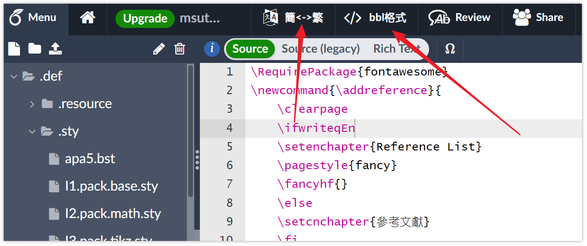

## 在线版
- 目前服务器在 24-03-20 日期之前访问仍然有效:

  https://pychat.online/bib2bbl

## 本地离线版
- overleaf project 的目录  .tool/bib2bbl.html

  https://www.overleaf.com/project/6405fae66739a31d6b2f37a2

## chrome 浏览器扩展程序

[下载安装 overleaf s2t/bib2bbl](https://user-images.githubusercontent.com/30061185/233447600-a9ec4138-d73c-4914-84c3-600431556016.mp4 ':include :type=video controls width=75%')

- [chrome 扩展程序下载地址:](https://chrome.google.com/webstore/detail/overleaf-s2tbib2bbl/icekiliecbhnockmfkehoebbkmhmapmo?hl=zh-CN)
- 下载与安装
- - chrome 商店搜索关键词  `overleaf bib2bbl`

- - chrome 商店搜索关键词  `overleaf s2t`

## 使用方法
- 打开 overleaf project 顶部会增加两个功能

  
  